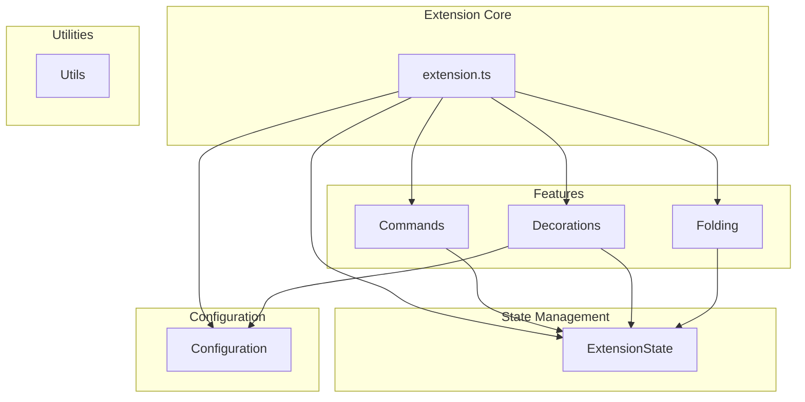

# Point Blank

Point Blank is a VS Code extension that provides a powerful outliner mode for plain text and Markdown files. It enhances readability and navigation by providing indent-based code folding, custom bullet point decorations, and a focus mode to hoist the current block into focus.

## Features

- **Indent-Based Folding:** Automatically creates folding ranges based on indentation, allowing you to collapse and expand blocks of text.
- **Custom Bullet Points:** Provides a variety of bullet point decorations to visually distinguish between different list item types.
- **Focus Mode:** A command to fold all code blocks except for the one containing the cursor, helping you focus on the current context.
- **Configurable Colors:** Customize the colors of the bullet point decorations to match your theme.

## Supported Files

- Plain Text (`.txt`)
- Markdown (`.md`)
- Untitled files

## Commands

| Command | Title | Keybinding |
| --- | --- | --- |
| `pointblank.focusMode` | Point Blank: Focus Mode (Hoisting) | `Alt+F` |
| `pointblank.unfocusMode` | Point Blank: Unfocus | `Alt+U` |

## Extension Settings

This extension contributes the following settings:

- `pointblank.level1Color`: Defines the color for default bullet points (e.g., '•').
- `pointblank.level2Color`: Defines the color for asterisk bullet points (e.g., '*').
- `pointblank.level3Color`: Defines the color for plus bullet points (e.g., '+').
- `pointblank.level4Color`: Defines the color for minus bullet points (e.g., '-').
- `pointblank.level5Color`: Defines the color for numbered bullet points (e.g., '1.', '2)').
- `pointblank.blockquoteColor`: Defines the color for blockquote prefixes (e.g., '>').

## Architecture

The extension is built with a modular architecture to separate concerns and improve maintainability.

## Contributing

Contributions are welcome! Please feel free to open an issue or submit a pull request.

### Development

1.  Clone the repository.
2.  Run `pnpm install` to install the dependencies.
3.  Run `pnpm run watch` to start the webpack watcher.
4.  Press `F5` to open a new VS Code window with the extension loaded.