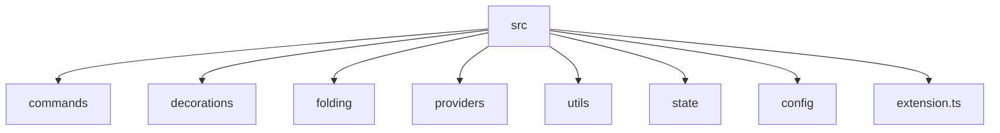
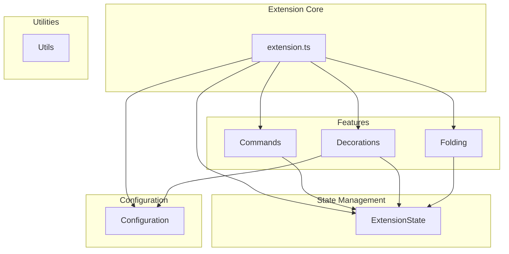

# Refactoring Plan: Point Blank VS Code Extension

This plan outlines a comprehensive refactoring of the Point Blank VS Code extension to improve its structure, maintainability, and adherence to modern TypeScript and software design best practices.

## 1. High-Level Goals

*   **Improve Code Clarity:** Make the code easier to understand for new and existing contributors.
*   **Enhance Maintainability:** Simplify the process of fixing bugs and adding new features.
*   **Modernize the Codebase:** Apply modern TypeScript features and design patterns.
*   **Increase Robustness:** Improve error handling and state management.

## 2. Proposed Project Structure

The current structure is flat. A more modular structure will separate concerns more effectively.

*   **`src/commands`**: Will contain all command-related logic (e.g., `focusMode`, `unfocusMode`).
*   **`src/decorations`**: Will house all decoration-related logic, including the `DecorationApplier` and decoration type definitions.
*   **`src/folding`**: Will contain the `IndentFoldingRangeProvider` and related utilities.
*   **`src/providers`**: A more generic directory for all providers (currently just the folding provider).
*   **`src/utils`**: For generic utility functions (e.g., `debounce`).
*   **`src/state`**: A new directory to manage the application's state, such as the active editor and decorations.
*   **`src/config`**: For handling configuration-related logic.
*   **`src/extension.ts`**: Will remain the main entry point, but will be simplified by delegating to other modules.

## 3. Detailed Refactoring Steps

### Step 1: Restructure Files and Directories

1.  Create the new directory structure as outlined above.
2.  Move existing files to their new locations:
    *   `src/foldingProvider.ts` -> `src/providers/indentFoldingProvider.ts`
    *   `src/decorations/decorationApplier.ts` -> `src/decorations/decorationApplier.ts`
    *   `src/constants.ts` -> `src/decorations/decorationTypes.ts`
    *   `src/utils/debounce.ts` -> `src/utils/debounce.ts`
    *   `src/utils/foldingUtils.ts` -> `src/folding/foldingUtils.ts`
    *   `src/utils/lineFilters.ts` -> `src/decorations/lineFilters.ts`
3.  Create new files for command logic:
    *   `src/commands/focusMode.ts`
    *   `src/commands/unfocusMode.ts`
4.  Create new files for state and configuration management:
    *   `src/state/extensionState.ts`
    *   `src/config/configuration.ts`

### Step 2: Refactor State Management

The current state management is scattered. The `activeEditor` is passed around, and decoration types are global variables.

1.  **Create an `ExtensionState` class** in `src/state/extensionState.ts`.
    *   This class will be a singleton, providing a single source of truth for the extension's state.
    *   It will manage the `activeEditor`, decoration types, and any other shared state.
    *   It will expose methods to update and retrieve state.

2.  **Refactor `decorationTypes.ts`** (`constants.ts`).
    *   The `initializeDecorations` function will be moved to the `ExtensionState` class.
    *   Decoration types will be stored as properties of the `ExtensionState` class.

### Step 3: Refactor Command Logic

1.  **Extract command logic** from `src/extension.ts` into the new command files.
    *   `pointblank.focusMode` logic will go into `src/commands/focusMode.ts`.
    *   `pointblank.unfocusMode` logic will go into `src/commands/unfocusMode.ts`.
2.  **Each command file will export a function** that takes the `ExtensionState` as a parameter.
3.  **In `src/extension.ts`, import and register the commands**, passing the `ExtensionState` instance.

### Step 4: Refactor Decoration Logic

1.  **Refactor `DecorationApplier`**.
    *   It will no longer manage the `activeEditor`. Instead, it will receive it as a parameter in its methods.
    *   It will get decoration types from the `ExtensionState` instance.
2.  **Refactor `decorationTypes.ts`**.
    *   The `initializeDecorations` function will be moved to a new `Configuration` class.

### Step 5: Refactor Configuration Management

1.  **Create a `Configuration` class** in `src/config/configuration.ts`.
    *   This class will be responsible for reading and providing configuration values from `vscode.workspace.getConfiguration('pointblank')`.
    *   It will have methods like `getBulletColor()` or `getFoldingOnSave()`.
    *   The `initializeDecorations` logic will be moved here, and it will be called when the configuration changes.

### Step 6: Simplify `extension.ts`

After the refactoring, `src/extension.ts` should be much simpler. Its primary responsibilities will be:

1.  Initializing the `ExtensionState` and `Configuration` singletons.
2.  Registering commands, providers, and event listeners.
3.  Passing the `ExtensionState` and `Configuration` instances to the relevant modules.

### Step 7: Add Comments and Documentation

1.  **Add JSDoc comments** to all classes, methods, and functions, explaining their purpose, parameters, and return values.
2.  **Add inline comments** to explain complex logic.
3.  **Update `README.md`** to reflect the new structure and any new features or configuration options.

## 4. Mermaid Diagram of the Final Architecture

This diagram shows the dependencies between the different modules. The `extension.ts` file orchestrates the different parts of the extension, while the `ExtensionState` and `Configuration` modules provide shared state and configuration to the feature modules.